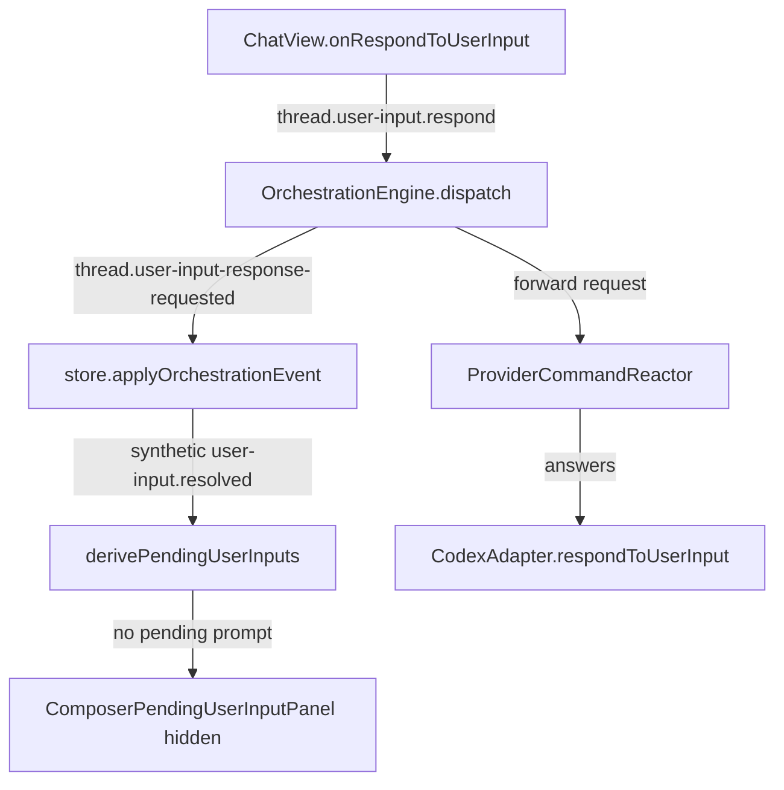

# Recap: Plan Mode User Input Submit

> Generated: 2026-05-11 | Scope: 6 files changed

---

## Summary

The goal was to fix Plan Mode user-input submission getting stuck after clicking "Submit answers". The change makes the composer use the correct user-input responding state, hides the pending prompt once the response command is accepted, and preserves multi-select question metadata through the Codex and web parsing layers. Targeted tests now pass for the touched store, session logic, and Codex adapter behavior.

---

## Files Affected

| File                                              | Status   | Role                                                                                                   |
| ------------------------------------------------- | -------- | ------------------------------------------------------------------------------------------------------ |
| `apps/web/src/components/ChatView.tsx`            | Modified | Wires pending user-input panels to `respondingUserInputRequestIds` instead of approval response state. |
| `apps/web/src/store.ts`                           | Modified | Adds a synthetic `user-input.resolved` activity when a user-input response command is accepted.        |
| `apps/web/src/session-logic.ts`                   | Modified | Preserves `multiSelect: true` when deriving pending user-input questions.                              |
| `apps/server/src/provider/Layers/CodexAdapter.ts` | Modified | Preserves `multiSelect: true` when mapping Codex requestUserInput payloads.                            |
| `apps/web/src/store.test.ts`                      | Modified | Verifies accepted user-input responses add a resolved activity for detail state.                       |
| `apps/web/src/session-logic.test.ts`              | Modified | Verifies multi-select user-input metadata survives parsing.                                            |

---

## Logic Explanation

### Problem

Plan Mode asks can block on `request_user_input`, and the web composer derives pending prompts from thread activities. The sidebar summary already cleared pending state when `thread.user-input-response-requested` arrived, but the active composer still saw the old `user-input.requested` activity until the provider later emitted `user-input.resolved`.

### Approach

The fix keeps the UI responsive at the moment the app accepts the submit command. Instead of waiting for the provider's follow-up event, the client inserts a synthetic resolved activity into the thread detail state, which lets the existing pending-input derivation close the prompt through the normal path.

### Step-by-step

1. `ChatView.tsx` now passes `respondingUserInputRequestIds` into `ComposerPendingUserInputPanel`, so the option controls disable against the correct submit state.
2. `store.ts` handles `thread.user-input-response-requested` by adding one synthetic `user-input.resolved` activity keyed by request id and event sequence.
3. `session-logic.ts` and `CodexAdapter.ts` preserve `multiSelect: true` without adding explicit `false`, keeping compatibility with existing payload shapes.

### Tradeoffs & Edge Cases

The synthetic activity is client-side detail state only; the provider can still append its real resolved activity afterward. The synthetic id is stable for the event sequence, so repeated application does not duplicate it.

---

## Flow Diagram

### Happy Path

---

## High School Explanation

Imagine the app asks you a question and waits for your answer. Before, when you clicked submit, one part of the app knew your answer was sent, but the chat box still kept the question card on screen until another confirmation arrived later.

Now, as soon as the app accepts your answer, it puts a small note in its own checklist saying "this question is done." The chat box reads that checklist and closes the question card right away. If the deeper system sends another confirmation later, that is fine too.
